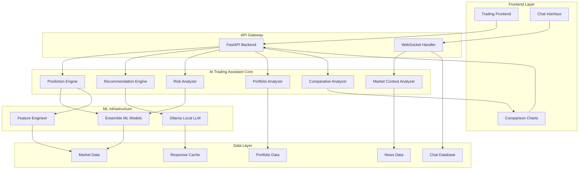

# AI Trading Assistant Design Document

## Overview

The AI Trading Assistant enhances the existing ML-based trading system by integrating advanced predictive capabilities, intelligent recommendation generation, and sophisticated market analysis. The system leverages ensemble machine learning models, large language models (LLMs), and real-time market data to provide comprehensive trading insights, price predictions, and risk analysis through both API endpoints and WebSocket connections.

The assistant builds upon the existing FastAPI backend infrastructure, extending the current LLM service with specialized trading analysis capabilities while maintaining the established patterns for WebSocket communication, caching, and rate limiting.

## Architecture

### High-Level Architecture



### Component Integration

The AI Trading Assistant integrates with existing system components:

- **Existing ML Models**: Extends current LSTM/GRU models with ensemble techniques
- **Ollama Service**: Replaces external LLM service with local Ollama instance for privacy and control
- **WebSocket Handler**: Adds new message types for predictions and recommendations
- **Data Fetcher**: Utilizes existing market data infrastructure
- **Technical Indicators**: Leverages current indicator calculations

## Components and Interfaces

### 1. Prediction Engine

**Purpose**: Generate multi-timeframe stock price predictions with confidence intervals

**Key Methods**:
```python
class PredictionEngine:
    async def generate_predictions(
        self, 
        symbol: str, 
        timeframes: List[str] = ["1d", "3d", "7d", "30d"]
    ) -> PredictionResult
    
    async def calculate_confidence_intervals(
        self, 
        predictions: np.ndarray, 
        volatility: float
    ) -> ConfidenceInterval
    
    async def ensemble_predict(
        self, 
        models: List[MLModel], 
        features: np.ndarray
    ) -> EnsemblePrediction
```

**Integration Points**:
- Uses existing MLModels class for base predictions
- Extends MLFeatureEngineer for advanced feature creation
- Integrates with TechnicalIndicators for market analysis

### 2. Recommendation Engine

**Purpose**: Generate intelligent buy/sell recommendations with detailed rationale

**Key Methods**:
```python
class RecommendationEngine:
    async def generate_recommendation(
        self, 
        symbol: str, 
        prediction: PredictionResult, 
        risk_analysis: RiskAssessment
    ) -> TradingRecommendation
    
    async def calculate_position_size(
        self, 
        recommendation: TradingRecommendation, 
        portfolio: Portfolio
    ) -> PositionSize
    
    async def generate_rationale(
        self, 
        recommendation: TradingRecommendation
    ) -> str
```

**Integration Points**:
- Leverages OllamaService for rationale generation instead of external LLM services
- Uses existing notification system for alerts
- Integrates with GoogleSheetsLogger for tracking

### 3. Risk Analyzer

**Purpose**: Analyze risk factors and provide comprehensive risk assessments

**Key Methods**:
```python
class RiskAnalyzer:
    async def calculate_risk_metrics(
        self, 
        symbol: str, 
        portfolio: Portfolio
    ) -> RiskMetrics
    
    async def assess_portfolio_risk(
        self, 
        portfolio: Portfolio
    ) -> PortfolioRisk
    
    async def generate_risk_alerts(
        self, 
        risk_metrics: RiskMetrics
    ) -> List[RiskAlert]
```

### 4. Market Context Analyzer

**Purpose**: Analyze news sentiment and market conditions

**Key Methods**:
```python
class MarketContextAnalyzer:
    async def analyze_news_sentiment(
        self, 
        symbol: str, 
        timeframe: str = "24h"
    ) -> SentimentAnalysis
    
    async def detect_market_events(
        self, 
        market_data: Dict[str, Any]
    ) -> List[MarketEvent]
    
    async def update_context(
        self, 
        context_data: Dict[str, Any]
    ) -> None
```

**Integration Points**:
- Extends existing news sentiment analyzer
- Uses TradingContextProvider for context management
- Integrates with WebSocket for real-time updates

### 5. Portfolio Analyzer

**Purpose**: Analyze portfolio performance and suggest optimizations

**Key Methods**:
```python
class PortfolioAnalyzer:
    async def analyze_performance(
        self, 
        portfolio: Portfolio
    ) -> PerformanceAnalysis
    
    async def suggest_rebalancing(
        self, 
        portfolio: Portfolio
    ) -> RebalancingPlan
    
    async def calculate_attribution(
        self, 
        portfolio: Portfolio
    ) -> AttributionAnalysis
```

### 6. Comparative Analyzer

**Purpose**: Generate comparative analysis and visualizations between multiple stocks

**Key Methods**:
```python
class ComparativeAnalyzer:
    async def compare_stocks(
        self, 
        symbols: List[str], 
        metrics: List[str], 
        timeframe: str
    ) -> ComparisonResult
    
    async def generate_comparison_chart(
        self, 
        comparison_data: ComparisonResult, 
        chart_type: str
    ) -> ChartData
    
    async def calculate_correlations(
        self, 
        symbols: List[str], 
        timeframe: str
    ) -> CorrelationMatrix
    
    async def rank_opportunities(
        self, 
        comparison_data: ComparisonResult
    ) -> RankingResult
```

### 7. Ollama Service

**Purpose**: Interface with local Ollama LLM instance for natural language processing and rationale generation

**Key Methods**:
```python
class OllamaService:
    async def initialize_connection(
        self, 
        model_name: str = "llama2", 
        host: str = "localhost:11434"
    ) -> bool
    
    async def generate_rationale(
        self, 
        recommendation: TradingRecommendation, 
        market_context: Dict[str, Any]
    ) -> str
    
    async def process_natural_language_query(
        self, 
        query: str, 
        context: Dict[str, Any]
    ) -> str
    
    async def explain_analysis(
        self, 
        analysis_data: Dict[str, Any], 
        user_level: str = "intermediate"
    ) -> str
    
    async def health_check(self) -> bool
```

**Integration Points**:
- Replaces external LLM service calls with local Ollama requests
- Provides fallback responses when Ollama is unavailable
- Integrates with existing caching mechanisms for response optimization
- Uses structured prompts for consistent trading analysis output

## Data Models

### Core Data Structures

```python
@dataclass
class PredictionResult:
    symbol: str
    predictions: Dict[str, float]  # timeframe -> price
    confidence_intervals: Dict[str, ConfidenceInterval]
    confidence_score: float
    timestamp: datetime
    model_ensemble: List[str]

@dataclass
class ConfidenceInterval:
    lower_bound: float
    upper_bound: float
    confidence_level: float

@dataclass
class TradingRecommendation:
    symbol: str
    action: str  # "BUY", "SELL", "HOLD"
    confidence: float
    target_price: float
    stop_loss: float
    position_size: float
    rationale: str
    risk_reward_ratio: float
    timestamp: datetime

@dataclass
class RiskMetrics:
    symbol: str
    var_1d: float  # Value at Risk
    var_5d: float
    beta: float
    volatility: float
    sharpe_ratio: float
    max_drawdown: float
    correlation_to_market: float

@dataclass
class ComparisonResult:
    symbols: List[str]
    metrics: Dict[str, Dict[str, float]]  # symbol -> metric -> value
    correlations: CorrelationMatrix
    rankings: Dict[str, List[str]]  # ranking_type -> ordered_symbols
    chart_data: Dict[str, Any]
    timestamp: datetime

@dataclass
class SentimentAnalysis:
    symbol: str
    sentiment_score: float  # -1 to 1
    news_count: int
    key_themes: List[str]
    confidence: float
    sources: List[str]
    timestamp: datetime

@dataclass
class OllamaConfig:
    model_name: str
    host: str
    port: int
    timeout: int
    max_tokens: int
    temperature: float

@dataclass
class OllamaResponse:
    content: str
    model_used: str
    tokens_used: int
    response_time: float
    success: bool
    error_message: Optional[str] = None
```

### Database Extensions

Extend existing chat database with trading-specific tables:

```sql
-- Predictions tracking
CREATE TABLE predictions (
    id TEXT PRIMARY KEY,
    symbol TEXT NOT NULL,
    timeframe TEXT NOT NULL,
    predicted_price REAL NOT NULL,
    confidence_score REAL NOT NULL,
    actual_price REAL,
    accuracy REAL,
    created_at TIMESTAMP DEFAULT CURRENT_TIMESTAMP,
    validated_at TIMESTAMP
);

-- Recommendations tracking
CREATE TABLE recommendations (
    id TEXT PRIMARY KEY,
    symbol TEXT NOT NULL,
    action TEXT NOT NULL,
    confidence REAL NOT NULL,
    target_price REAL NOT NULL,
    stop_loss REAL NOT NULL,
    rationale TEXT,
    created_at TIMESTAMP DEFAULT CURRENT_TIMESTAMP,
    outcome TEXT,
    outcome_date TIMESTAMP
);

-- Risk assessments
CREATE TABLE risk_assessments (
    id TEXT PRIMARY KEY,
    symbol TEXT NOT NULL,
    var_1d REAL NOT NULL,
    beta REAL NOT NULL,
    volatility REAL NOT NULL,
    created_at TIMESTAMP DEFAULT CURRENT_TIMESTAMP
);
```

## Correctness Properties

*A property is a characteristic or behavior that should hold true across all valid executions of a system-essentially, a formal statement about what the system should do. Properties serve as the bridge between human-readable specifications and machine-verifiable correctness guarantees.*

Before writing the correctness properties, let me analyze the acceptance criteria for testability:

<function_calls>
<invoke name="prework">
<parameter name="featureName">ai-trading-assistant

Based on the prework analysis, I'll now perform a property reflection to eliminate redundancy and consolidate related properties:

**Property Reflection:**

After reviewing all testable properties, I've identified several areas for consolidation:

1. **Prediction completeness properties (1.1, 1.2, 1.4)** can be combined into a comprehensive prediction structure property
2. **Recommendation completeness properties (2.2, 2.4)** can be consolidated into a single recommendation structure property  
3. **Risk analysis completeness properties (3.1, 3.5)** can be combined into a comprehensive risk assessment property
4. **Logging completeness properties (7.1, 7.2, 7.3)** can be consolidated into a comprehensive logging property
5. **Portfolio analysis completeness properties (5.1, 5.5)** can be combined into a single comprehensive analysis property
6. **Natural language response completeness properties (6.2, 6.4)** can be consolidated into a comprehensive response property

The following properties provide unique validation value and will be retained as separate properties:
- Performance and timing requirements (2.3, 4.2)
- Behavioral responses to specific conditions (1.5, 2.5, 3.2, 3.3, 3.4, 4.3, 5.2, 8.2, 8.4)
- Learning and adaptation properties (8.1, 8.3, 8.5)
- User interaction and customization properties (6.1, 6.3, 6.5, 9.1, 9.2, 9.3, 9.4, 9.5)

### Correctness Properties

Property 1: Complete prediction structure
*For any* stock symbol, when generating predictions, the system should return predictions for all four timeframes (1d, 3d, 7d, 30d) with confidence intervals containing upper and lower bounds, and confidence scores between 0 and 100
**Validates: Requirements 1.1, 1.2, 1.4**

Property 2: Prediction input incorporation
*For any* stock prediction, the calculation process should incorporate technical indicators, market sentiment data, and historical patterns
**Validates: Requirements 1.3**

Property 3: Volatility-adjusted confidence intervals
*For any* prediction generated during high market volatility periods, the confidence intervals should be wider than those generated during normal volatility periods
**Validates: Requirements 1.5**

Property 4: Complete recommendation structure
*For any* trading recommendation generated, it should include position size suggestions, expected price targets, and stop-loss levels
**Validates: Requirements 2.2, 2.4**

Property 5: High-confidence recommendation generation
*For any* high-confidence trading opportunity (confidence > 80%), the system should generate buy or sell recommendations with detailed rationale
**Validates: Requirements 2.1**

Property 6: Recommendation update timeliness
*For any* rapid market condition change, recommendation updates should be generated within 5 minutes
**Validates: Requirements 2.3**

Property 7: Low-confidence recommendation handling
*For any* recommendation with confidence below 70%, the system should advise waiting for better opportunities
**Validates: Requirements 2.5**

Property 8: Complete risk assessment
*For any* potential trade analysis, the system should calculate risk-reward ratios and assess impact on overall portfolio risk metrics
**Validates: Requirements 3.1, 3.5**

Property 9: Portfolio concentration warnings
*For any* portfolio where individual positions exceed safe concentration levels, the system should warn about diversification risks
**Validates: Requirements 3.2**

Property 10: Volatility-based position sizing
*For any* high-volatility stock analysis, the system should recommend appropriate position sizing adjustments
**Validates: Requirements 3.3**

Property 11: Market instability response
*For any* unstable market conditions, the system should provide risk alerts and defensive strategies
**Validates: Requirements 3.4**

Property 12: News sentiment incorporation
*For any* stock analysis, the system should incorporate recent news sentiment scores from multiple validated sources
**Validates: Requirements 4.1, 4.4**

Property 13: Market event response timeliness
*For any* significant market event, prediction model adjustments should occur within 15 minutes
**Validates: Requirements 4.2**

Property 14: Sector news propagation
*For any* sector-specific news event, predictions should be updated for all stocks in that sector
**Validates: Requirements 4.3**

Property 15: Economic indicator integration
*For any* economic indicator release, the system should factor the data into market-wide predictions
**Validates: Requirements 4.5**

Property 16: Complete portfolio analysis
*For any* portfolio analysis request, the system should identify allocation deviations and provide performance attribution with improvement suggestions
**Validates: Requirements 5.1, 5.5**

Property 17: High correlation diversification recommendations
*For any* portfolio where correlation between holdings exceeds 0.7, the system should recommend diversification improvements
**Validates: Requirements 5.2**

Property 18: Cost-aware rebalancing suggestions
*For any* rebalancing suggestion, the system should consider transaction costs and tax implications
**Validates: Requirements 5.3**

Property 19: Portfolio fit evaluation
*For any* new opportunity evaluation, the system should assess how it fits within the existing portfolio
**Validates: Requirements 5.4**

Property 20: Clear prediction explanations
*For any* user query about stock predictions, the system should provide clear explanations with supporting rationale
**Validates: Requirements 6.1**

Property 21: Comprehensive analysis responses
*For any* user request for stock analysis or portfolio performance, the system should provide comprehensive technical and fundamental analysis with complete performance metrics
**Validates: Requirements 6.2, 6.4**

Property 22: Structured recommendation explanations
*For any* recommendation explanation, the system should break down the analysis into understandable components
**Validates: Requirements 6.3**

Property 23: Ambiguous query handling
*For any* ambiguous natural language request, the system should ask clarifying questions
**Validates: Requirements 6.5**

Property 24: Comprehensive logging
*For any* prediction, recommendation, or risk analysis, the system should log all input data, outputs, decision rationale, and relevant metadata
**Validates: Requirements 7.1, 7.2, 7.3**

Property 25: Error logging completeness
*For any* system error, detailed error information should be logged for debugging purposes
**Validates: Requirements 7.4**

Property 26: Complete audit traceability
*For any* audit report generation, the system should provide complete traceability from market data to recommendations
**Validates: Requirements 7.5**

Property 27: Prediction accuracy tracking
*For any* prediction that can be validated, the system should compare actual outcomes with predicted results
**Validates: Requirements 8.1**

Property 28: Performance-based model retraining
*For any* 30-day period where prediction accuracy falls below 60%, the system should initiate model retraining
**Validates: Requirements 8.2**

Property 29: Performance pattern identification
*For any* prediction performance analysis, the system should identify patterns in successful and unsuccessful predictions
**Validates: Requirements 8.3**

Property 30: Automatic model adjustment
*For any* detected model performance degradation, the system should automatically adjust model weights and parameters
**Validates: Requirements 8.4**

Property 31: Scheduled model updates
*For any* week when continuous learning is enabled, the system should update models with new market data
**Validates: Requirements 8.5**

Property 32: Flexible comparison requests
*For any* user stock comparison request, the system should allow selection of 2-5 stocks and choice of visualization types
**Validates: Requirements 9.1**

Property 33: Customized chart generation
*For any* user-specified chart preferences, the system should generate charts including the requested elements (price, volume, indicators, or confidence levels)
**Validates: Requirements 9.2**

Property 34: Flexible metric calculations
*For any* user request for specific comparison metrics, the system should calculate and display the chosen metrics (correlation, volatility, performance ratios)
**Validates: Requirements 9.3**

Property 35: Customizable ranking criteria
*For any* comparative report generation, the system should allow users to select ranking criteria and display results accordingly
**Validates: Requirements 9.4**

Property 36: Conditional sector analysis
*For any* user request, sector analysis should be provided only when specifically requested by the user
**Validates: Requirements 9.5**

Property 37: Local rationale generation
*For any* trading rationale generation request, the system should use the locally hosted Ollama LLM model rather than external services
**Validates: Requirements 10.2**

Property 38: Privacy-preserving query processing
*For any* natural language query processing, the system should handle requests without sending data to external services
**Validates: Requirements 10.4**

## Error Handling

### Error Categories and Responses

**Data Availability Errors**:
- Missing market data: Return cached predictions with reduced confidence
- API failures: Fallback to alternative data sources
- Database connectivity: Use in-memory caching with degraded functionality

**Model Errors**:
- Model loading failures: Fallback to simpler baseline models
- Prediction errors: Return error with explanation and suggested alternatives
- Ensemble failures: Use individual model predictions with adjusted confidence

**Performance Errors**:
- Timeout errors: Return partial results with timeout indication
- Rate limiting: Queue requests with estimated wait times
- Memory errors: Reduce batch sizes and process incrementally

**User Input Errors**:
- Invalid symbols: Suggest similar valid symbols
- Malformed requests: Provide clear error messages with examples
- Ambiguous queries: Ask clarifying questions through natural language

**Ollama Service Errors**:
- Connection failures: Provide fallback responses with reduced functionality
- Model loading errors: Retry with alternative models or provide cached responses
- Timeout errors: Return partial responses with timeout indication
- Performance degradation: Log metrics and suggest optimization strategies

### Error Recovery Strategies

```python
class ErrorHandler:
    async def handle_prediction_error(
        self, 
        error: Exception, 
        symbol: str
    ) -> PredictionResult:
        if isinstance(error, DataUnavailableError):
            return await self._get_cached_prediction(symbol)
        elif isinstance(error, ModelError):
            return await self._get_baseline_prediction(symbol)
        else:
            return self._get_error_response(error, symbol)
    
    async def handle_recommendation_error(
        self, 
        error: Exception, 
        context: Dict[str, Any]
    ) -> TradingRecommendation:
        return TradingRecommendation(
            action="HOLD",
            confidence=0.0,
            rationale=f"Unable to generate recommendation: {str(error)}",
            timestamp=datetime.now()
        )
    
    async def handle_ollama_error(
        self, 
        error: Exception, 
        query: str
    ) -> str:
        if isinstance(error, ConnectionError):
            return "Ollama service unavailable. Using fallback response generation."
        elif isinstance(error, TimeoutError):
            return "Response generation timed out. Please try a simpler query."
        else:
            return f"Unable to process query with local LLM: {str(error)}"
```

## Testing Strategy

### Dual Testing Approach

The AI Trading Assistant will use both unit testing and property-based testing to ensure comprehensive coverage:

**Unit Testing**:
- Specific examples that demonstrate correct behavior for known inputs
- Integration points between components (API endpoints, database operations)
- Error conditions and edge cases (invalid inputs, network failures)
- Mock external dependencies (market data APIs, LLM services)

**Property-Based Testing**:
- Universal properties that should hold across all inputs using Hypothesis (Python)
- Each property-based test will run a minimum of 100 iterations
- Tests will be tagged with comments referencing design document properties
- Format: `# Feature: ai-trading-assistant, Property {number}: {property_text}`

**Property-Based Testing Library**: Hypothesis for Python
**Configuration**: Minimum 100 iterations per property test
**Tagging**: Each test explicitly references its corresponding correctness property

**Testing Requirements**:
- Each correctness property must be implemented by a single property-based test
- Property tests verify universal behaviors across all valid inputs
- Unit tests catch concrete bugs and validate specific scenarios
- Together they provide comprehensive coverage of both general correctness and specific functionality

### Test Data Generation

**Market Data Generators**:
- Generate realistic stock price sequences with various volatility patterns
- Create synthetic news data with different sentiment scores
- Generate portfolio compositions with different risk profiles

**Edge Case Generators**:
- Extreme market conditions (crashes, bubbles, high volatility)
- Edge cases for confidence scores (0, 100, boundary values)
- Invalid or malformed user inputs

**Performance Test Scenarios**:
- High-frequency prediction requests
- Large portfolio analysis operations
- Concurrent user interactions through WebSocket

### Integration Testing

**API Integration**:
- Test all REST endpoints with various input combinations
- Validate WebSocket message handling and real-time updates
- Test integration with existing trading system components

**Database Integration**:
- Test prediction and recommendation storage and retrieval
- Validate audit trail completeness
- Test performance with large datasets

**External Service Integration**:
- Test LLM service integration with various query types
- Validate market data fetching and processing
- Test notification system integration

## Implementation Notes

### Performance Considerations

**Caching Strategy**:
- Cache predictions for 5 minutes to reduce computation load
- Cache market context data for 1 minute
- Use Redis for distributed caching in production

**Async Processing**:
- All prediction and analysis operations are async
- Use background tasks for model training and updates
- Implement request queuing for high-load scenarios

**Resource Management**:
- Limit concurrent prediction requests per user
- Implement circuit breakers for external API calls
- Monitor memory usage during ensemble model operations

### Security Considerations

**Input Validation**:
- Sanitize all user inputs for SQL injection prevention
- Validate stock symbols against known exchanges
- Rate limit API requests per user/IP

**Data Privacy**:
- Encrypt sensitive portfolio data at rest
- Use secure WebSocket connections (WSS)
- Implement audit logging for compliance

**Access Control**:
- Implement user authentication for personalized features
- Role-based access for administrative functions
- API key management for external integrations

### Ollama Integration

**Local LLM Setup**:
- Install and configure Ollama on the local system
- Download appropriate models (llama2, codellama, or mistral)
- Configure connection parameters (host, port, timeout)
- Implement health checks and connection monitoring

**Model Management**:
- Support multiple model switching based on query type
- Implement model warming to reduce first-request latency
- Monitor model performance and resource usage
- Provide model update and management capabilities

**Privacy and Security**:
- Ensure all LLM processing happens locally
- No data transmission to external services
- Local model storage and management
- Audit logging for compliance requirements

### Scalability Design

**Horizontal Scaling**:
- Stateless service design for easy replication
- Database connection pooling
- Load balancing for WebSocket connections

**Model Serving**:
- Separate model serving infrastructure
- Model versioning and A/B testing capabilities
- Gradual rollout of model updates

**Monitoring and Observability**:
- Comprehensive logging of all operations
- Performance metrics collection
- Real-time alerting for system issues